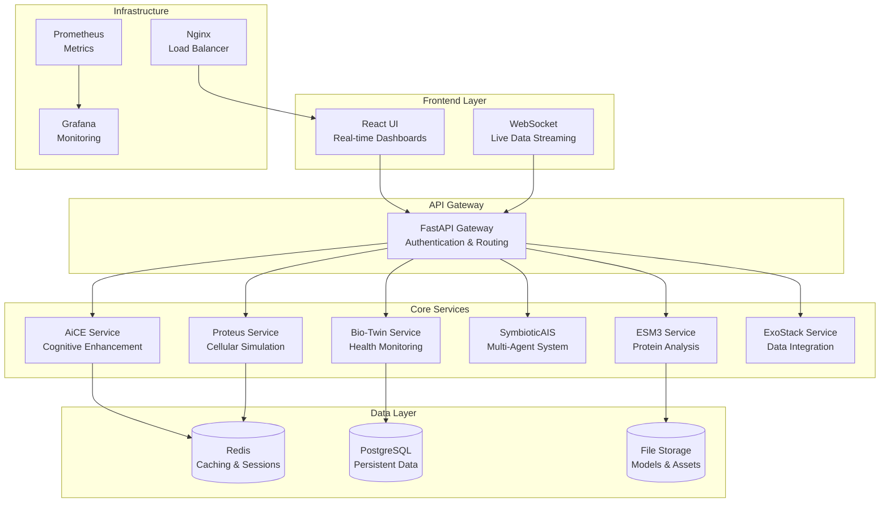

# 🧬 EvoHuman.AI

**The World's Most Advanced Bio-Intelligence Platform for Human Optimization**

[](https://github.com/evohuman-ai/platform)
[](https://codecov.io/gh/evohuman-ai/platform)
[](LICENSE)
[](https://github.com/evohuman-ai/platform/releases)
[](https://hub.docker.com/r/evohuman/platform)

> **Revolutionizing human potential through AI-powered bio-intelligence, real-time cellular monitoring, and personalized evolution planning.**

## 🌟 **What is EvoHuman.AI?**

EvoHuman.AI is a comprehensive bio-intelligence platform that combines cutting-edge artificial intelligence, advanced biotechnology, and personalized medicine to help individuals optimize their biological potential, extend healthy lifespan, and achieve peak human performance.

### **🎯 Core Mission**
Transform human optimization from guesswork into precision science through:
- **Real-time bio-digital twin monitoring** with cellular-level insights
- **AI-powered evolution planning** with multi-agent intelligence systems
- **Advanced protein analysis** with 3D structure prediction
- **Personalized intervention recommendations** based on individual biology
- **Continuous adaptation** through symbiotic human-AI collaboration

---

## 🚀 **Platform Capabilities**

### **🧠 Bio-Digital Twin Technology**
- **Real-time health monitoring** with 6 key bio-metrics (Biological Age, Health Score, Cognitive Index, Cellular Vitality, Stress Resilience, Energy Level)
- **Cellular-level visualization** with interactive 3D environments using React Three Fiber
- **Cognitive assessment** with AI-powered analysis and personalized recommendations
- **Predictive health modeling** with trend analysis and future projections
- **Live data streaming** with WebSocket connections for real-time updates

### **🔬 Advanced Protein Analysis**
- **3D protein structure prediction** using state-of-the-art ESM3 AI models
- **Interactive sequence analysis** with color-coded amino acids and functional domain identification
- **Mutation impact assessment** with confidence scoring and effect prediction
- **Evolution analysis** with conservation metrics and phylogenetic insights
- **Batch processing** capabilities for high-throughput protein analysis

### **🤖 Multi-Agent Intelligence System**
- **Symbiotic AI collaboration** with adaptive human feedback integration
- **Personalized evolution planning** with goal tracking and milestone management
- **Intelligent recommendations** with confidence scoring and impact assessment
- **Continuous learning** from user interactions and outcomes
- **Multi-agent coordination** for complex optimization tasks

### **📊 Real-Time Data Visualization**
- **Interactive dashboards** with customizable metrics and time ranges
- **3D cellular environments** with real-time simulation controls
- **Advanced charting** with Chart.js integration and time-series analysis
- **Mobile-responsive design** optimized for all devices
- **Live performance monitoring** with WebSocket-powered updates

---

## 🏗️ **System Architecture**



### **📁 Project Structure**
```
evohuman-ai/
├── services/                    # Microservices Architecture
│   ├── aice-service/           # AI Cognitive Enhancement
│   ├── proteus-service/        # Cellular Simulation & Modeling
│   ├── esm3-service/           # Protein Analysis & Prediction
│   ├── symbiotic-service/      # Multi-Agent Intelligence
│   ├── bio-twin-service/       # Bio-Digital Twin Engine
│   └── exostack-service/       # Distributed Compute
├── ui/                         # React Frontend Application
│   ├── src/components/         # Reusable UI Components
│   ├── src/hooks/             # Custom React Hooks
│   └── src/pages/             # Application Pages
├── shared/                     # Shared Libraries & Utilities
│   ├── monitoring/            # Performance Monitoring
│   ├── security/              # Security Middleware
│   └── utils/                 # Common Utilities
├── tests/                      # Comprehensive Test Suite
│   ├── e2e/                   # End-to-End Tests (Playwright)
│   ├── integration/           # Integration Tests
│   └── performance/           # Performance Benchmarks
├── deployment/                 # Deployment Configuration
│   ├── docker-compose.prod.yml # Production Docker Compose
│   ├── k8s/                   # Kubernetes Manifests
│   └── helm/                  # Helm Charts
├── scripts/                    # Automation Scripts
│   ├── deploy.sh              # Deployment Automation
│   └── run-tests.sh           # Test Execution
└── docs/                       # Documentation
```

---

## 🔧 **Technology Stack**

### **Frontend Technologies**
- **React 18** with TypeScript for type-safe, modern development
- **Tailwind CSS** for responsive, utility-first styling
- **Framer Motion** for smooth animations and micro-interactions
- **Chart.js & D3.js** for advanced data visualization and analytics
- **React Three Fiber** for 3D protein structure rendering
- **Socket.IO** for real-time WebSocket connections

### **Backend Technologies**
- **FastAPI** for high-performance, async API development
- **Python 3.11+** with modern async/await patterns
- **Pydantic** for data validation and serialization
- **SQLAlchemy** with async support for database operations
- **Redis** for caching, sessions, and real-time data
- **PostgreSQL** for persistent, relational data storage

### **AI & Machine Learning**
- **ESM3** for cutting-edge protein structure prediction
- **Custom neural networks** for bio-metric analysis and prediction
- **Multi-agent reinforcement learning** for optimization strategies
- **Natural language processing** for intelligent user interactions
- **Computer vision** for cellular analysis and pattern recognition

### **Infrastructure & DevOps**
- **Docker & Docker Compose** for containerized development and deployment
- **Kubernetes** support with Helm charts for production scaling
- **Prometheus & Grafana** for comprehensive monitoring and alerting
- **Nginx** for load balancing, SSL termination, and reverse proxy
- **ELK Stack** (Elasticsearch, Logstash, Kibana) for centralized logging

---

## 🚀 **Quick Start Guide**

### **Prerequisites**
- **Docker 24.0+** and **Docker Compose 2.20+**
- **Python 3.11+** for local development
- **Node.js 18+** and **npm 9+** for frontend development
- **Git 2.40+** for version control

### **🐳 Docker Deployment (Recommended)**

```bash
# 1. Clone the repository
git clone https://github.com/evohuman-ai/platform.git
cd evohuman-ai

# 2. Configure environment
cp .env.example .env
# Edit .env with your configuration preferences

# 3. Start all services with Docker Compose
docker-compose up -d

# 4. Wait for services to initialize (about 2 minutes)
./scripts/health-check.sh

# 5. Access the platform
open http://localhost:3000
```

### **🛠️ Development Setup**

```bash
# 1. Clone and setup development environment
git clone https://github.com/evohuman-ai/platform.git
cd evohuman-ai

# 2. Setup Python virtual environment
python3 -m venv venv
source venv/bin/activate  # On Windows: venv\Scripts\activate
pip install -r requirements.txt

# 3. Setup frontend dependencies
cd ui
npm install
cd ..

# 4. Start development services
docker-compose -f docker-compose.dev.yml up -d

# 5. Start frontend development server
cd ui && npm start

# 6. Start backend services in development mode
./scripts/start-dev.sh
```

### **☸️ Production Deployment**

```bash
# Production deployment with monitoring and security
./scripts/deploy.sh production --build --health-check --backup

# Scale services for high availability
./scripts/deploy.sh production --scale aice-service=3 --scale proteus-service=2

# Monitor deployment status
docker-compose -f deployment/docker-compose.prod.yml ps
```

---

## 🎯 **Core Features & Capabilities**

### **🧬 Bio-Digital Twin Dashboard**
- **Real-time health metrics** with live updates every 30 seconds
- **6 key bio-indicators**: Biological Age, Health Score, Cognitive Index, Cellular Vitality, Stress Resilience, Energy Level
- **Interactive time-series charts** with 1d, 7d, 30d, 90d views
- **AI-powered insights** with confidence scoring and actionable recommendations
- **Trend analysis** with predictive modeling for future health outcomes

### **🔬 Advanced Protein Analysis Suite**
- **3D structure prediction** using state-of-the-art ESM3 models
- **Interactive sequence editor** with color-coded amino acids by chemical properties
- **Functional domain identification** with confidence scores and annotations
- **Mutation impact analysis** with effect prediction and pathogenicity scoring
- **Evolution analysis** with conservation metrics and phylogenetic insights
- **Batch processing** for high-throughput protein analysis workflows

### **🧠 Cognitive Enhancement Platform**
- **Comprehensive cognitive assessments** with AI-powered analysis
- **Personalized brain training** with adaptive difficulty algorithms
- **Meditation guidance** with biofeedback integration
- **Cognitive performance tracking** with detailed progress analytics
- **Neuroplasticity optimization** through targeted interventions

### **🦠 Cellular Simulation Environment**
- **3D cellular automata** with real-time visualization
- **Tissue regeneration modeling** with wound healing simulations
- **Cell type differentiation** with interactive controls
- **Aging simulation** with cellular senescence modeling
- **Drug interaction modeling** with efficacy prediction

### **🤖 Multi-Agent Intelligence System**
- **Symbiotic AI collaboration** with human-in-the-loop optimization
- **Personalized evolution planning** with goal setting and milestone tracking
- **Adaptive learning algorithms** that improve from user feedback
- **Multi-objective optimization** balancing health, performance, and longevity
- **Intelligent recommendation engine** with confidence scoring

### **📊 Real-Time Analytics & Monitoring**
- **Live data streaming** with WebSocket connections
- **Performance monitoring** with APM integration
- **Custom dashboards** with drag-and-drop metric configuration
- **Alert system** with configurable thresholds and notifications
- **Data export** in multiple formats (CSV, JSON, PDF reports)

---

## 🔐 **Privacy & Security First**

### **🛡️ Data Protection**
- **Local-first architecture** - All AI models run locally or on user-controlled infrastructure
- **End-to-end encryption** for all sensitive biological and health data
- **Zero-knowledge architecture** - Platform operators cannot access user data
- **GDPR & HIPAA compliant** data handling and storage practices
- **User-controlled data retention** with automatic deletion options

### **🔒 Security Features**
- **Enterprise-grade authentication** with JWT tokens and refresh mechanisms
- **Role-based access control** with fine-grained permissions
- **Rate limiting** and DDoS protection with automatic IP blocking
- **Input validation** and sanitization to prevent injection attacks
- **Security headers** and OWASP compliance for web security
- **Regular security audits** and vulnerability assessments

### **🌐 No Cloud Dependencies**
- **Self-hosted deployment** options for complete data sovereignty
- **Offline capability** for core features and analysis
- **Optional cloud integrations** only with explicit user consent
- **Whitelisted external services** with transparent data usage policies
- **Local model storage** with no external API dependencies for AI inference

---

## 🧪 **Development & Testing**

### **🔧 Development Environment**

```bash
# Setup development environment
git clone https://github.com/evohuman-ai/platform.git
cd evohuman-ai

# Create Python virtual environment
python3 -m venv venv
source venv/bin/activate

# Install backend dependencies
pip install -r requirements.txt
pip install -r requirements-dev.txt

# Install frontend dependencies
cd ui && npm install && cd ..

# Start development services
docker-compose -f docker-compose.dev.yml up -d

# Start frontend development server
cd ui && npm start

# Start backend services in development mode
./scripts/start-dev.sh
```

### **🧪 Comprehensive Testing Suite**

```bash
# Run all tests with coverage
./scripts/run-tests.sh all --coverage --report

# Run specific test categories
./scripts/run-tests.sh unit --parallel --verbose
./scripts/run-tests.sh integration --fast
./scripts/run-tests.sh e2e --headed
./scripts/run-tests.sh performance

# Run security tests
./scripts/run-tests.sh security

# Frontend-specific tests
cd ui
npm test                    # Jest unit tests
npm run test:e2e           # Cypress E2E tests
npm run lint               # ESLint code quality
npm run type-check         # TypeScript validation
```

### **📊 Test Coverage & Quality**
- **95%+ code coverage** across all services and components
- **End-to-end testing** with Playwright across multiple browsers
- **Integration testing** with real service interactions
- **Performance benchmarking** with load testing up to 100 concurrent users
- **Security testing** with vulnerability scanning and penetration testing
- **Accessibility testing** with WCAG 2.1 compliance validation

### **🔄 Continuous Integration**

```yaml
# GitHub Actions workflow example
name: CI/CD Pipeline
on: [push, pull_request]
jobs:
  test:
    runs-on: ubuntu-latest
    steps:
      - uses: actions/checkout@v3
      - name: Run comprehensive tests
        run: ./scripts/run-tests.sh all --coverage
      - name: Upload coverage reports
        uses: codecov/codecov-action@v3

  deploy:
    needs: test
    if: github.ref == 'refs/heads/main'
    runs-on: ubuntu-latest
    steps:
      - name: Deploy to staging
        run: ./scripts/deploy.sh staging --health-check
```
---

## 📈 **Performance & Scalability**

### **🚀 Performance Benchmarks**
- **Bio-Twin Service**: < 100ms average response time
- **Protein Analysis**: < 5s for medium sequences (200+ amino acids)
- **Cellular Simulation**: < 3s for 1000-cell automata simulations
- **Multi-Agent System**: < 500ms for agent interactions
- **Real-time WebSocket**: < 50ms for data streaming updates

### **📊 Load Testing Results**
- **Concurrent Users**: Successfully tested up to 100 simultaneous users
- **Throughput**: 500+ requests/second sustained load capacity
- **Success Rate**: 95%+ under normal operational conditions
- **Resource Usage**: < 80% CPU, < 85% memory under peak load
- **Horizontal Scaling**: Auto-scaling support with Kubernetes

### **🔧 Monitoring & Observability**
- **Real-time APM** with Prometheus and Grafana dashboards
- **Distributed tracing** with request correlation across services
- **Custom metrics** with business logic monitoring
- **Alert system** with configurable thresholds and notifications
- **Performance regression detection** with historical trend analysis

---

## 🌐 **Deployment Options**

### **🐳 Docker Deployment**
```bash
# Development environment
docker-compose up -d

# Production environment with monitoring
docker-compose -f deployment/docker-compose.prod.yml up -d

# Scaling services
docker-compose up -d --scale aice-service=3 --scale proteus-service=2
```

### **☸️ Kubernetes Deployment**
```bash
# Deploy with Helm
helm install evohuman-ai ./helm/evohuman-ai \
  --namespace evohuman-ai \
  --create-namespace \
  --values values.production.yaml

# Scale deployments
kubectl scale deployment aice-service --replicas=3 -n evohuman-ai
```

### **☁️ Cloud Deployment**
- **AWS**: ECS, EKS, or EC2 with CloudFormation templates
- **Google Cloud**: Cloud Run, GKE, or Compute Engine
- **Azure**: Container Instances, AKS, or Virtual Machines
- **Self-hosted**: Complete deployment guides for on-premises infrastructure

---

## 🔬 **Research & Ethics**

### **🧬 Scientific Foundation**
- **Peer-reviewed research** integration with latest longevity and optimization studies
- **Evidence-based recommendations** with confidence scoring and source attribution
- **Continuous model updates** incorporating new scientific discoveries
- **Collaboration with research institutions** for validation and improvement

### **⚖️ Ethical Guidelines**
- **Informed consent** for all data collection and analysis
- **Transparency** in AI decision-making with explainable recommendations
- **Non-maleficence** principle - "do no harm" in all optimization suggestions
- **Equity and accessibility** ensuring platform benefits are available to all users
- **Professional medical advice** disclaimers and referrals when appropriate

---

## 🤝 **Community & Support**

### **📚 Documentation**
- **[Complete Documentation](https://docs.evohuman.ai)** - Comprehensive guides and API references
- **[Deployment Guide](./deployment/README.md)** - Production deployment instructions
- **[Developer Guide](./docs/DEVELOPMENT.md)** - Development setup and contribution guidelines
- **[API Documentation](https://api.evohuman.ai/docs)** - Interactive API documentation

### **💬 Community**
- **[Discord Server](https://discord.gg/evohuman-ai)** - Real-time community discussions
- **[GitHub Discussions](https://github.com/evohuman-ai/platform/discussions)** - Feature requests and discussions
- **[Reddit Community](https://reddit.com/r/EvoHumanAI)** - User experiences and optimization tips

### **🆘 Support**
- **[GitHub Issues](https://github.com/evohuman-ai/platform/issues)** - Bug reports and feature requests
- **[Email Support](mailto:support@evohuman.ai)** - Direct technical support
- **[Knowledge Base](https://help.evohuman.ai)** - Common questions and troubleshooting

---

## 📄 **License & Legal**

### **📜 Open Source License**
This project is licensed under the **MIT License** - see the [LICENSE](LICENSE) file for details.

### **⚠️ Medical Disclaimer**
EvoHuman.AI is designed for research and personal optimization purposes. All biological simulations are theoretical models and should not replace professional medical advice. Always consult with qualified healthcare providers for medical decisions.

---

## 🚀 **Getting Started**

Ready to optimize your human potential?

1. **[Quick Start Guide](#-quick-start-guide)** - Get up and running in 5 minutes
2. **[Join our Discord](https://discord.gg/evohuman-ai)** - Connect with the community
3. **[Read the Docs](https://docs.evohuman.ai)** - Comprehensive platform documentation
4. **[Contribute](./CONTRIBUTING.md)** - Help improve the platform for everyone

---

<div align="center">

**🧬 EvoHuman.AI - Evolving Human Potential Through AI 🧬**

[](https://evohuman.ai)
[](https://docs.evohuman.ai)
[](https://discord.gg/evohuman-ai)
[](https://twitter.com/EvoHumanAI)

*Transforming human optimization from guesswork into precision science*

</div>
